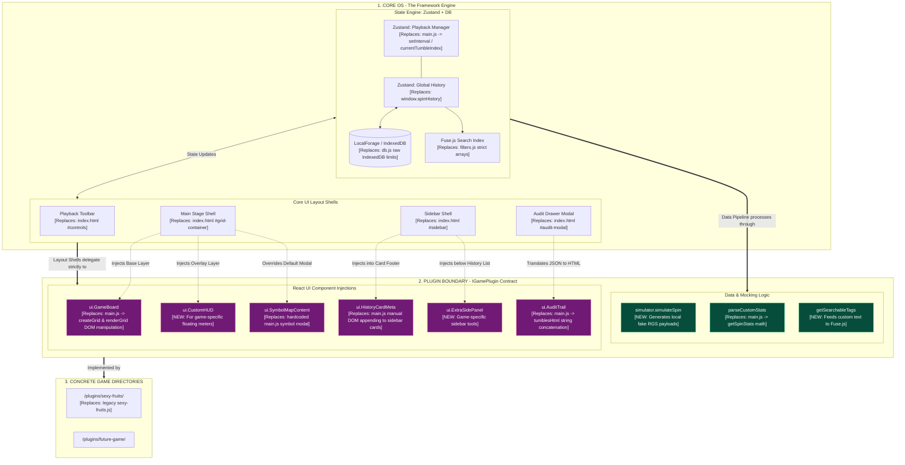

```mermaid
flowchart TD
    %% Styling
    classDef os fill:#1e293b,stroke:#cbd5e1,stroke-width:2px,color:#fff
    classDef plugin fill:#312e81,stroke:#a78bfa,stroke-width:2px,color:#fff
    classDef logic fill:#064e3b,stroke:#34d399,stroke-width:1px,color:#fff
    classDef inject fill:#701a75,stroke:#f472b6,stroke-width:1px,color:#fff

    %% ==========================================
    %% LAYER 1: THE CORE OS
    %% ==========================================
    subgraph CoreOS [1. CORE OS - The Framework Engine]
        direction LR
        
        subgraph State [State Engine: Zustand + DB]
            direction TB
            Playback["Zustand: Playback Manager<br/>[Replaces: main.js -> setInterval / currentTumbleIndex]"]
            History["Zustand: Global History<br/>[Replaces: window.spinHistory]"]
            DB[("LocalForage / IndexedDB<br/>[Replaces: db.js raw IndexedDB limits]")]
            Search["Fuse.js Search Index<br/>[Replaces: filters.js strict arrays]"]
            
            Playback --- History
            History <--> DB
            History --> Search
        end
        
        subgraph UI [Core UI Layout Shells]
            direction TB
            Toolbar["Playback Toolbar<br/>[Replaces: index.html #controls]"]
            Stage["Main Stage Shell<br/>[Replaces: index.html #grid-container]"]
            Sidebar["Sidebar Shell<br/>[Replaces: index.html #sidebar]"]
            Audit["Audit Drawer Modal<br/>[Replaces: index.html #audit-modal]"]
        end
        
        State <-->|State Updates| UI
    end

    %% ==========================================
    %% LAYER 2: THE PLUGIN BOUNDARY
    %% ==========================================
    subgraph PluginContract [2. PLUGIN BOUNDARY - IGamePlugin Contract]
        direction LR
        
        subgraph DataHooks [Data & Mocking Logic]
            direction TB
            Mock["simulator.simulateSpin<br/>[NEW: Generates local fake RGS payloads]"]:::logic
            Parse["parseCustomStats<br/>[Replaces: main.js -> getSpinStats math]"]:::logic
            Tags["getSearchableTags<br/>[NEW: Feeds custom text to Fuse.js]"]:::logic
        end

        subgraph UIHooks [React UI Component Injections]
            direction TB
            Board["ui.GameBoard<br/>[Replaces: main.js -> createGrid & renderGrid DOM manipulation]"]:::inject
            HUD["ui.CustomHUD<br/>[NEW: For game-specific floating meters]"]:::inject
            Map["ui.SymbolMapContent<br/>[Replaces: hardcoded main.js symbol modal]"]:::inject
            Card["ui.HistoryCardMeta<br/>[Replaces: main.js manual DOM appending to sidebar cards]"]:::inject
            Panel["ui.ExtraSidePanel<br/>[NEW: Game-specific sidebar tools]"]:::inject
            Trail["ui.AuditTrail<br/>[Replaces: main.js -> tumblesHtml string concatenation]"]:::inject
        end
    end

    %% ==========================================
    %% LAYER 3: CONCRETE GAMES
    %% ==========================================
    subgraph Cartridges [3. CONCRETE GAME DIRECTORIES]
        direction LR
        SF["/plugins/sexy-fruits/<br/>[Replaces: legacy sexy-fruits.js]"]
        CJ["/plugins/future-game/"]
    end

    %% ==========================================
    %% RELATIONSHIPS
    %% ==========================================
    UI =="Layout Shells delegate strictly to"==> UIHooks
    State =="Data Pipeline processes through"==> DataHooks
    PluginContract =="Implemented by"==> Cartridges

    %% Mapping exactly how the Core injects the Plugin UI
    Stage -. "Injects Base Layer" .-> Board
    Stage -. "Injects Overlay Layer" .-> HUD
    Stage -. "Overrides Default Modal" .-> Map
    
    Sidebar -. "Injects into Card Footer" .-> Card
    Sidebar -. "Injects below History List" .-> Panel
    
    Audit -. "Translates JSON to HTML" .-> Trail
```