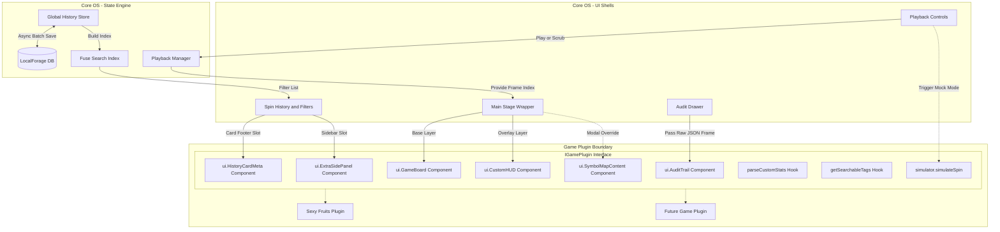

```mermaid
flowchart TB
    subgraph UI_Shells [Core OS - UI Shells]
        direction TB
        Toolbar[Playback Controls]
        Sidebar[Spin History and Filters]
        Stage[Main Stage Wrapper]
        Audit[Audit Drawer]
    end

    subgraph State_Engine [Core OS - State Engine]
        direction TB
        Playback[Playback Manager]
        History[Global History Store]
        Search[Fuse Search Index]
        DB[(LocalForage DB)]
    end

    subgraph Plugin_Boundary [Game Plugin Boundary]
        direction TB
        subgraph IGamePlugin [IGamePlugin Interface]
            GameBoard[ui.GameBoard Component]
            CustomHUD[ui.CustomHUD Component]
            CardMeta[ui.HistoryCardMeta Component]
            ExtraPanel[ui.ExtraSidePanel Component]
            SymbolMap[ui.SymbolMapContent Component]
            AuditUI[ui.AuditTrail Component]
            ParseStats[parseCustomStats Hook]
            GetTags[getSearchableTags Hook]
            Simulator[simulator.simulateSpin]
        end
        
        SexyFruits[Sexy Fruits Plugin]
        NewGame[Future Game Plugin]
        
        IGamePlugin -.-> SexyFruits
        IGamePlugin -.-> NewGame
    end

    %% Interaction Flows
    Toolbar -->|Play or Scrub| Playback
    Playback -->|Provide Frame Index| Stage
    History <-->|Async Batch Save| DB
    History -->|Build Index| Search
    Search -->|Filter List| Sidebar
    
    %% UI Injection Core-to-Plugin Flows
    Stage -->|Base Layer| GameBoard
    Stage -->|Overlay Layer| CustomHUD
    Stage -.->|Modal Override| SymbolMap
    
    Sidebar -->|Card Footer Slot| CardMeta
    Sidebar -->|Sidebar Slot| ExtraPanel
    
    Audit -->|Pass Raw JSON Frame| AuditUI
    
    %% Mocking Engine Flow
    Toolbar -.->|Trigger Mock Mode| Simulator
```